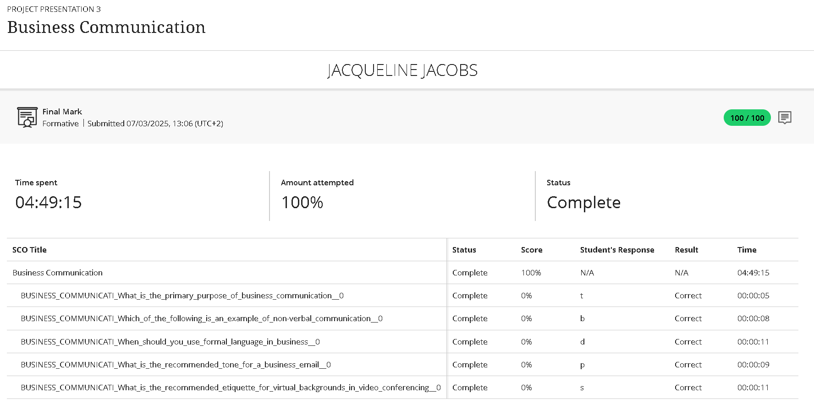
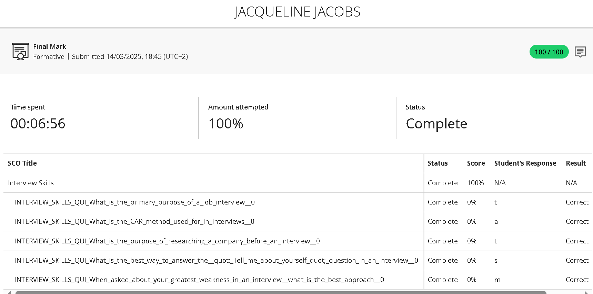
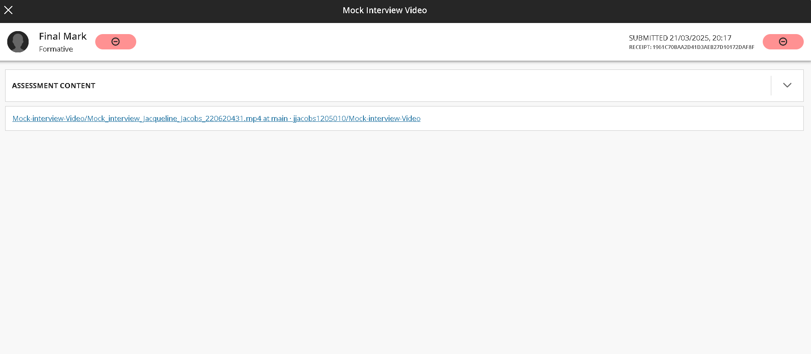
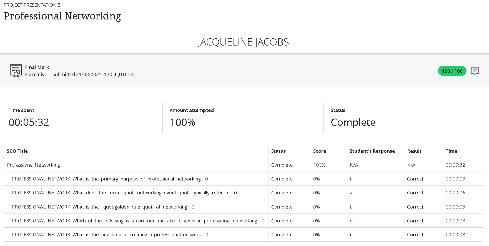
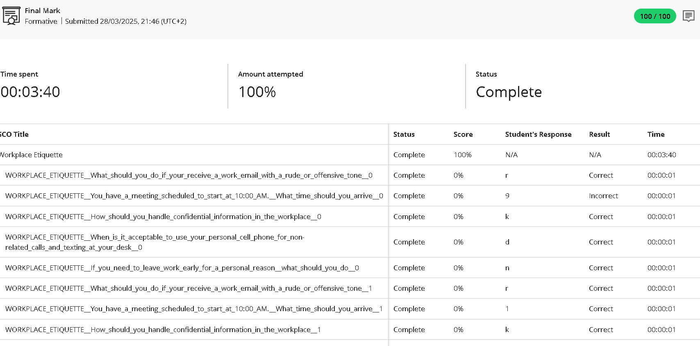

# JJacobs220620431-Digital-Portfolio

This digital portfolio showcases my personal and professional growth during the Work Readiness Training and my internship with Plum Systems. It highlights the development of my communication, collaboration, and technical skills, while demonstrating how I applied theoretical knowledge from my ICT studies in real-world projects. The portfolio also includes reflective evidence of how remote work shaped my adaptability and discipline.

## Business Communication
### Evidence

### STAR Reflection
**S – Situation:** Most of my internship communication took place online, I had to rely on email, WhatsApp and Microsoft Teams calls and messages to keep my team leader updated.

**T – Task:** I had to apply professional communication principles when writing and responding to formal messages.

**A – Action:** I used the skills learned in this lesson to structure my messages clearly, using professional language, and summarised key points.

**R – Result:** My written communication improved greatly, and I gained confidence in expressing ideas professionally in digital formats.

## Interview Skills

### Evidence

### STAR Reflection
**S – Situation:** To prepare for internship applications, I had to practise how to present myself professionally in a virtual interview.

**T – Task:** To develop confident and structured answers for interview questions.

**A – Action:**  I used the skills taught in the lesson, did research on interview questions and recorded short practice responses.

**R – Result:** My confidence in virtual interviews increased, and I learned how to stay calm and clear when answering questions.

## Mock Interview

### Evidence

### STAR Reflection
**S – Situation:**  As part of the Work Readiness module, I was required to record a self-conducted mock interview to demonstrate interview skills.

**T – Task:** To conduct and record a simulated professional interview.

**A – Action:**   I prepared by setting up my laptop with a professional background, dressed appropriately, and recorded my responses using my laptop camera. I focused on maintaining eye contact and clear speech.

**R – Result:** The exercise helped me identify areas for improvement such as tone, pacing, and body language. Recording the video gave me a practical understanding of how I appear to potential employers and increased my confidence for future interviews.

## Professional Networking

### Evidence

### STAR Reflection
**S – Situation:**  Since my internship was mostly remote, I relied on online platforms to build professional relationships.

**T – Task:** To create and maintain a professional online presence and effectively share my work with classmates and my team leader.

**A – Action:** I used tools such as Visual Studio Code and Outlook Notes to document and share project work, notes, and updates. I used platforms like WhatsApp, email and Microsoft Teams calls to update my team leader and classmates.

**R – Result:**  I gained a better understanding of how professional practices operate in the workplace and observed real-world applications of networking and IoT.

## Workplace Etiquette

### Evidence

### STAR Reflection
**S – Situation:** Working remotely from home meant I had to demonstrate professionalism without a face-to-face team leader.

**T – Task:** Show accountability, punctuality, and respect during online meetings and submissions.

**A – Action:** I followed professional online behaviour—joining meetings on time, keeping my camera on when appropriate, muting when not speaking, and meeting all deadlines.

**R – Result:** I maintained a professional reputation with my team and learned that workplace etiquette applies equally to virtual environments.
